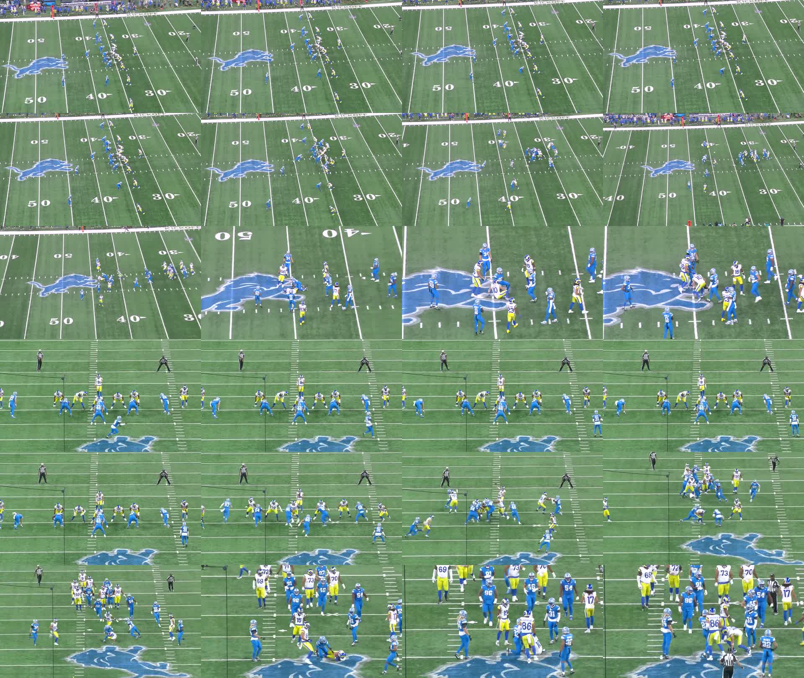

# Sample footage assessment

Inspected September 9, 2026. This is a media inspection, not a tracking result.

## Verified input

| Property | Value |
| --- | --- |
| Input | `data/all-22-lions-rams-sample.mp4` |
| SHA-256 | `3e7e9ada26b8adc94c98094db42130767c4871c54104c9ea49874d65393fa374` |
| Container size | 104,651,923 bytes |
| Duration | 23.757067 seconds |
| Video | HEVC Main, 1280 × 720, YUV 4:2:0 |
| Reported frame rate | 60000/1001, approximately 59.940 fps |
| Reported frame count | 1,424 |
| Video time base | 1/60000 second |
| Audio | AAC stereo, 48 kHz |

Source: local FFprobe output in [video-metadata.json](video-metadata.json). Container creation time is not evidence of the game's date. Frame count above is stream metadata, not an independently counted decoded-frame total.

## Visual observations

The [contact sheet](contact-sheet.jpg) samples the clip at one output image per second, in row-major order. FFmpeg's `fps=1` filter selects nearby source frames; the sheet is for overview, not exact event timing.



- The first shot has a high sideline perspective, pre-snap formation, active play, then a tighter post-play view. Camera framing and scale change substantially.
- The second shot starts at decoded frame 712, timestamp 11.878533 seconds, with an end-zone perspective. Zero-based frames 0–711 belong to shot 0; frames 712–1423 belong to shot 1, subject to decode verification during implementation.
- Consecutive frames [711–713](cut-frames-711-713.jpg) visually confirm the cut. FFmpeg's scene threshold of 0.30 missed it; 0.05 produced one candidate at 11.878533. A shared green field makes a single global color-change threshold insufficient as a general shot detector.
- The second view appears to replay the same play: formation, pre-snap movement, and subsequent action correspond. Exact replay alignment and snap timestamps have not been annotated.
- Blue uniforms and white/yellow uniforms are clearly distinct in these samples. The filename and visible branding support Lions/Rams labels, but no roster or game date has been verified.
- Referees and sideline personnel are present. Field membership and role filtering are necessary; generic person detection alone would include nonparticipants.
- The end-zone crop excludes some wide players. All-22 is the source format, not a guarantee that 22 players remain visible in every frame.
- At native resolution, the wide-shot players are small and overlap at the line. Some numbers are readable in the tighter end-zone shot; universal jersey readability is not supported by this inspection.
- Camera cables cross the end-zone image. Blocking, piles, truncation, and motion blur are plausible sources of missed detections and identity swaps.
- Football visibility is intermittent. No frame-by-frame ball or possession labels were created.

Native-resolution examples: [sideline at approximately 1 second](sideline-1s.jpg), [end-zone at approximately 14 seconds](endzone-14s.jpg).

## Reproduction

These are media inspection commands, not application commands:

```bash
ffprobe -v error -show_format -show_streams -of json data/all-22-lions-rams-sample.mp4
shasum -a 256 data/all-22-lions-rams-sample.mp4
ffmpeg -hide_banner -i data/all-22-lions-rams-sample.mp4 \
  -vf "select='gt(scene,0.05)',showinfo" -an -f null -
```

The full clip was decoded by FFmpeg while generating thumbnails and scene candidates. No detector, tracker, field calibration, or language-model analysis pipeline has been executed.
